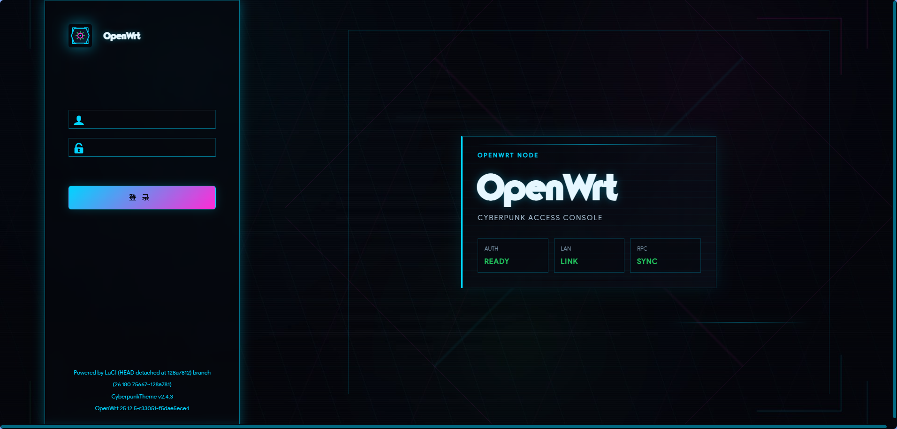
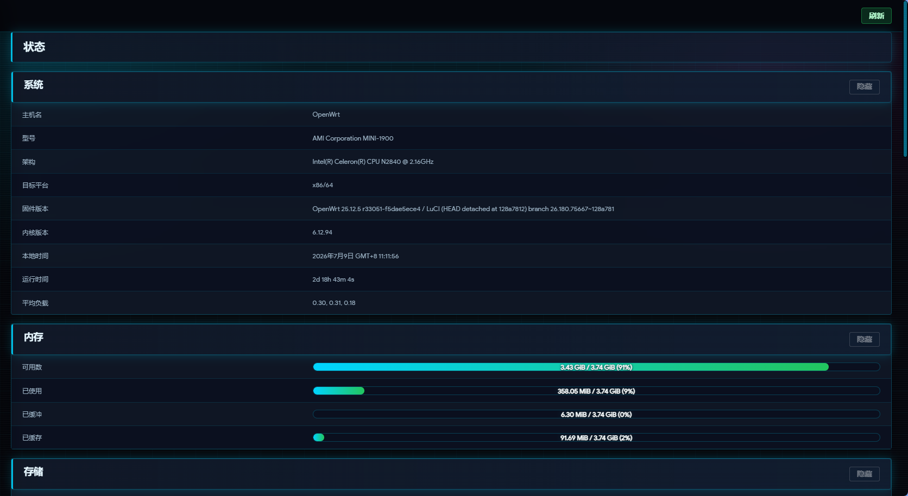
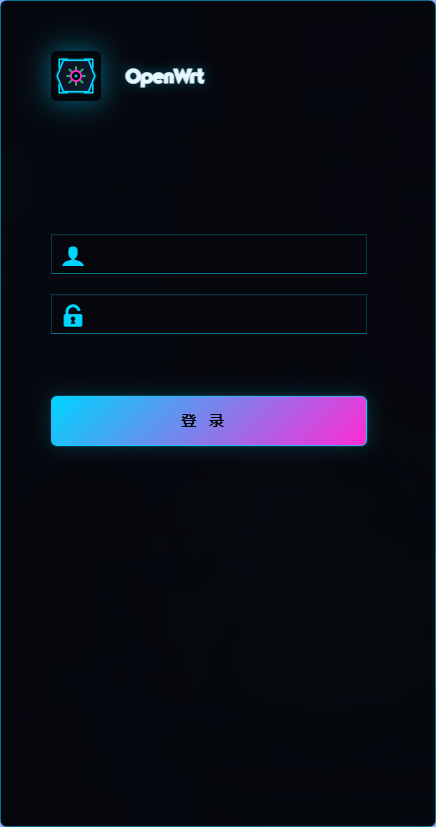
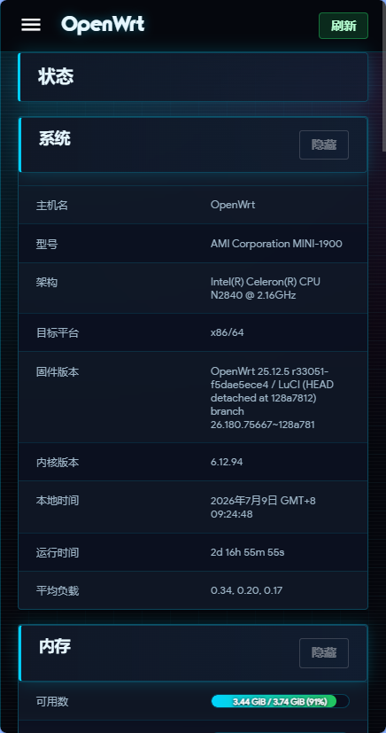

# Cyberpunk LuCI Theme

Cyberpunk is a dark OLED LuCI theme with a restrained neon HUD visual style for OpenWrt router administration.

[Document](/README.md) | [简体中文](/README_ZH.md)

## Features

- Independent LuCI theme package: `luci-theme-cyberpunk`
- Dark-first cyberpunk palette with cyan, magenta, and green status accents
- Cyberpunk login logo and local HUD-style background
- Dedicated theme assets under `/luci-static/cyberpunk`
- Dedicated menu module: `menu-cyberpunk`
- UCI config namespace: `cyberpunk`
- Wallpaper RPC helper: `luci.cyberpunk_wallpaper`

## Screenshots

### Desktop





### Mobile

<p align="center">
  
  
</p>

## Build

Place this package in an OpenWrt buildroot package feed and build it as a normal LuCI package.

```sh
make package/luci-theme-cyberpunk/compile V=s
```

## Installation

On OpenWrt versions after 24.10, install the downloaded APK package without a bundled signing key:

```sh
apk add --allow-untrusted luci-theme-cyberpunk-*.apk
```

## Credits

[luci-theme-material](https://github.com/LuttyYang/luci-theme-material/)
[luci-theme-argon](https://github.com/jerrykuku/luci-theme-argon)
